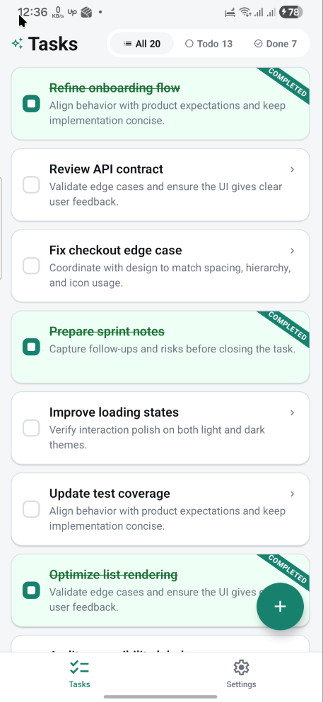
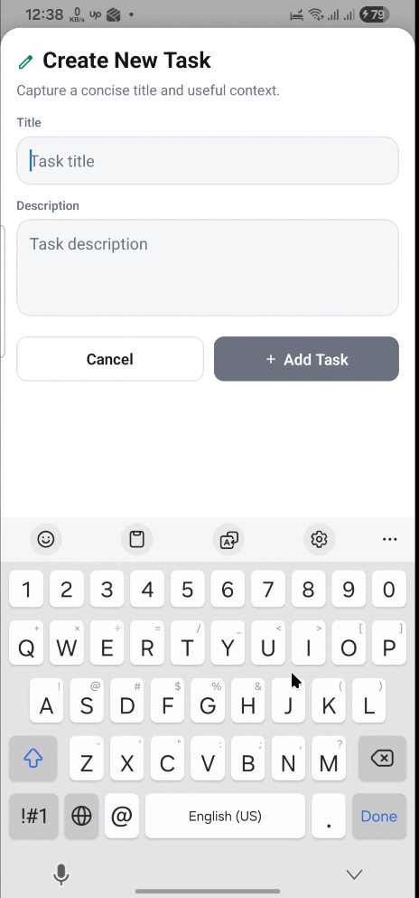
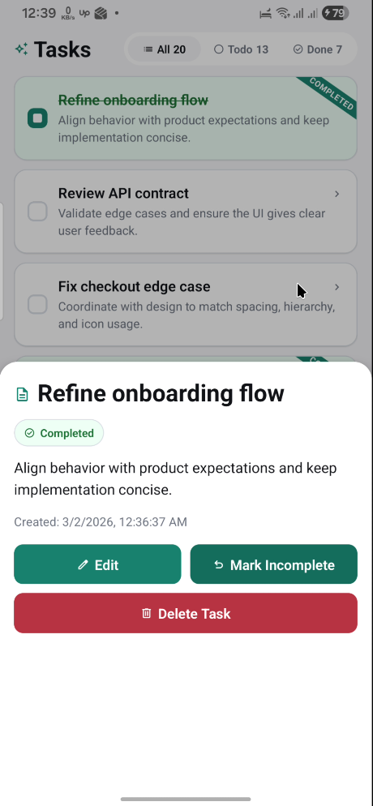
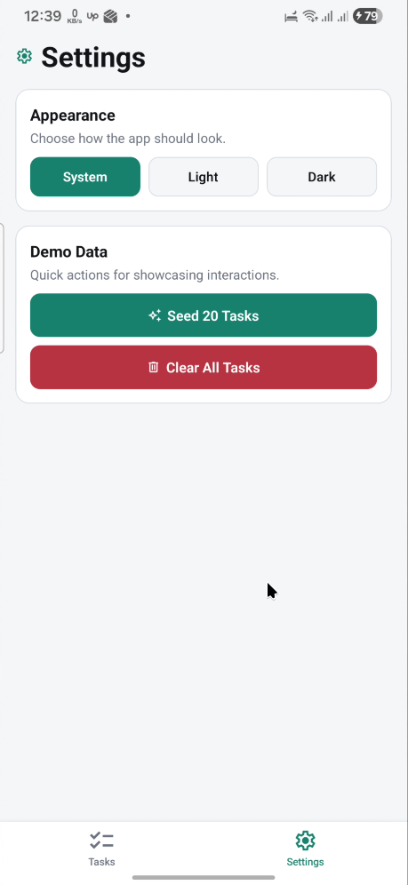

# Task Manager

> A task management app built with Expo Router and React Native

---

## Overview

This project demonstrates a polished task management app built as an interview/demo showcase. It features local task CRUD operations, filtering, theme support, and consistent UX patterns using Expo's file-based routing.

**Interview context:**

- Built to demonstrate file-based routing, custom components, state management, and UX polish in a React Native context.

---

## Features

**Core Features:**

- Create, edit, and delete tasks
- Toggle completion status
- Filter tasks by: All, Todo, Done (with live counts)
- View task details in sheet navigation
- Swipe-to-delete on list items with confirmation
- Theme switching: Light, Dark, System
- Demo data seeding (20 tasks) and clear all option

---

## Tech Stack

**Project Origin:**

- Started from Expo Router **tabs template**
- Uses Expo **file-based routing** for navigation

**Third-Party Libraries (Custom Additions):**

| Library                      | Purpose                               |
| ---------------------------- | ------------------------------------- |
| `expo-symbols`               | SF Symbols icons for iOS/Android/Web  |
| `react-native-toast-message` | Toast notifications for user feedback |

---

## Setup & Running

**Prerequisites:**

- Node.js 18+
- npm or yarn
- Expo CLI: `npm i -g expo-cli`

**Installation:**

```bash
# Clone repository
git clone <repository-url>
cd task-manager

# Install dependencies
npm install
```

**Running Locally:**

```bash
# Start Expo dev server
npm start

# Run on Android
npm run android

# Run on iOS
npm run ios

# Run on Web
npm run web
```

---

## Usage Instructions

**Creating Tasks:**

1. Tap the **+** FAB button or navigate to Tasks tab
2. Fill in title and description
3. Tap "Add Task"

**Managing Tasks:**

- Tap checkbox → toggle complete/incomplete
- Tap task text → open details sheet
- Swipe task item left → delete (with confirmation)
- Tap "Edit" in details → modify task

**Filtering:**

- Use All/Todo/Done buttons at top of list
- Live task counts displayed for each filter

**Theme:**

- Navigate to Settings tab
- Select Light, Dark, or System mode

**Demo Data:**

- Settings → "Seed 20 Tasks" for quick demo
- Settings → "Clear All Tasks" to reset

---

## Video Preview

### [📹 Watch Demo Video](./screenshots/video.mp4)

_Click to open or download full demo video_

> **Note:** Opens video file directly in browser or downloads for playback

---

## Project Structure

```
task-manager/
├── app/                           # Expo Router file-based routes
│   ├── (tabs)/                    # Tab navigation
│   │   ├── tasks/                # Tasks list screen
│   │   └── settings.tsx          # Settings screen
│   ├── tasks/                       # Task sheet routes
│   │   ├── create.tsx             # Create task sheet
│   │   ├── [id].tsx              # Task details sheet
│   │   └── [id]/edit.tsx        # Edit task sheet
│   └── _layout.tsx               # Root layout
├── components/                    # Reusable components
│   ├── task-item.tsx             # Task row with swipe delete
│   ├── task-list.tsx              # FlatList wrapper
│   └── task-not-found-state.tsx  # Task not found UI
├── contexts/                      # App state
│   └── tasks-context.tsx          # Task CRUD operations
├── hooks/                         # Custom React hooks
│   ├── use-app-theme.ts          # Theme hook
│   └── use-color-scheme.ts       # Color scheme hook
├── constants/                     # App configuration
│   └── theme.ts                 # Light/dark theme tokens
├── types/                         # TypeScript types
│   └── task.ts                  # Task type definition
├── utils/                         # Utilities
│   └── validators.ts            # Input validation
├── package.json                    # Dependencies and scripts
├── tsconfig.json                 # TypeScript config
└── app.json                      # Expo configuration
```

---

## Screenshots

**Note:** Add actual screenshots after testing

### Tasks Screen



_Task list with filter buttons and FAB_

### Create Task



_Bottom sheet form for creating tasks_

### Task Details



_Task details with edit and delete actions_

### Settings



_Theme selection and demo data controls_

---

## CI/CD

GitHub Actions workflow builds release APK on push to `main`:

- Uses Gradle `assembleRelease` with default signing
- Type check (`npx tsc --noEmit`) before build
- APK published to GitHub Releases with version tags

---

## License

This project is created for interview/demo purposes.
